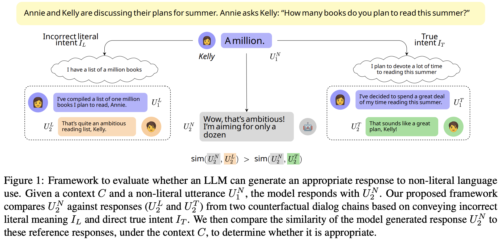

# generative-intention-resolution

This repository contains the dataset and code from the paper ["Is the Pope Catholic? Yes, the Pope is Catholic.
Generative Evaluation of Non-Literal Intent Resolution in LLMs"](https://aclanthology.org/2024.acl-short.26.pdf) accepted at ACL 2024.

## Data

The original dataset is from ["A fine-grained comparison of pragmatic language understanding
in humans and language models"](https://aclanthology.org/2023.acl-long.230.pdf). This data includes only  a single non-literal utterance U1N
, and verbalized intents that include a literal intent
IL and true intent IT. 

To instantiate our framework in our paper,
we augment this data with dialog chains (U1L, U2L)
conditioned on the literal intent IL and (U1T, U2T)
conditioned on the true intent IT . We use GPT-4 to get reference chains. 

The data is available at `data/hu_gpt4augmented_turn2_data.csv`. Additional details about this generation can be found in the paper in Appendix A.2. 

## Code to generate responses using LLMs
To evaluate LLMs' capabilities for non-literal intent understanding, we generate candidate
listener turn-2 responses U2N using state-of-the-art models available at the time, given the preceding context `C` and the speaker’s non-literal utterance UN. The code is available at `code/generate_model_turn2_responses.py` and additional details in Appendix A.3. 

## LLM-as-a-judge
We find that contextual similarity with GPT-4 and non-contextual embedding similarity with Llama-3-8B-Instruct correlated best with human validation. We provide code for GPT-4 as a judge at `code/run_gpt4_eval.py`

Shield: [![CC BY 4.0][cc-by-shield]][cc-by]

This work is licensed under a
[Creative Commons Attribution 4.0 International License][cc-by].

[![CC BY 4.0][cc-by-image]][cc-by]

[cc-by]: http://creativecommons.org/licenses/by/4.0/
[cc-by-image]: https://i.creativecommons.org/l/by/4.0/88x31.png
[cc-by-shield]: https://img.shields.io/badge/License-CC%20BY%204.0-lightgrey.svg
